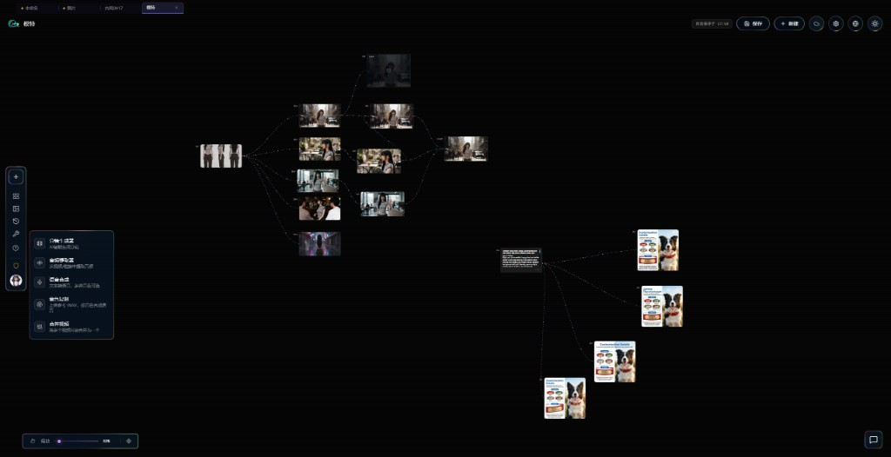
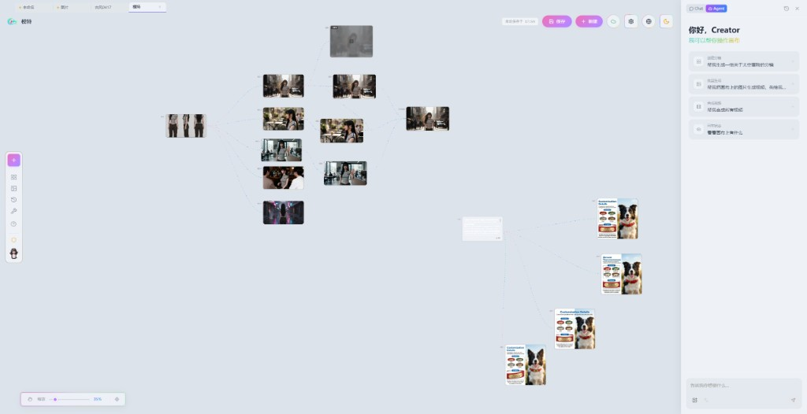
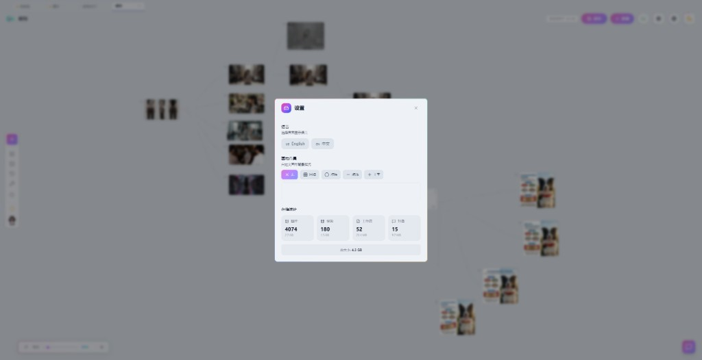
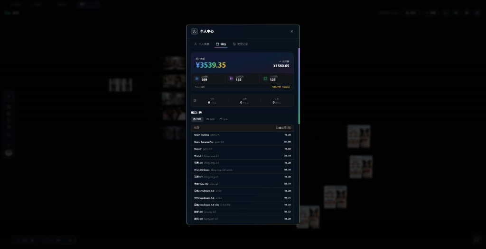
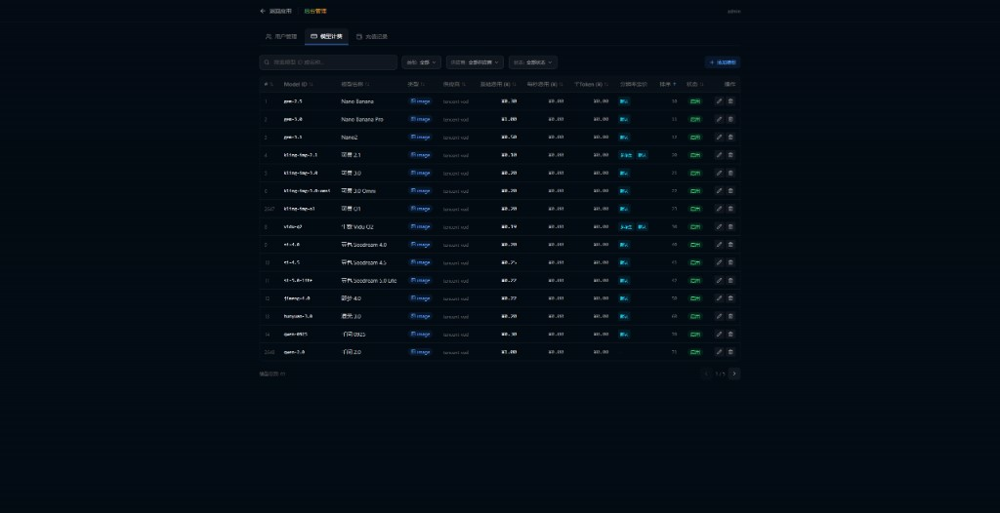

# ChuHaiBang Video Workflow · 出海帮 AI 视频工作流

一个基于画布（Canvas）的 AI 视频创作工作流系统：支持文生图 / 图生图、图生视频、分镜脚本生成、语音合成（TTS）、字幕擦除、以及内置 AI Agent 对话助手。

前端采用 React + Vite（可打包为 Electron 桌面端），后端采用 Node.js + Express，配合 MySQL / Redis / RabbitMQ 实现用户体系、任务队列与云端同步。

---

## 📌 开源作者 / Maintainer

本项目由 **中巨量（企业级 AI 智能体增长平台）** 开源发布。

- 官网 / Website: <https://www.zhongjuliang.com/>

> 需要**数据库信息 / 建表结构 / 部署配置**等资料，请通过以下方式联系获取：
>
> - 微信（WeChat）：`leizwei4088`
> - QQ：`994199830`

---

## ✨ 主要功能

- 🎨 无限画布，节点式管理图片 / 视频 / 音频等素材
- 🖼️ 多模型图像生成（ChuHaiBang / Gemini / fal 等）
- 🎬 图生视频（Kling、Hailuo、火山方舟 Seedance 等）
- 📝 分镜脚本（Storyboard）自动生成
- 🔊 语音合成与声音克隆（火山 TTS、Index-TTS）
- 🎧 音频提取与剪辑、视频合并 / 变速 / 裁剪
- 🧽 视频字幕擦除（Video Subtitle Remover）
- 🤖 内置 AI Agent 对话，可调用上述技能

## 🖼️ 界面预览 / Screenshots

**无限画布 · 分镜 → 图片 → 视频 全流程编排**



**内置 AI Agent，一句话操作画布**



**设置与本地素材存储统计（浅色主题）**



**个人中心 · 钱包与模型计价**



**后台管理 · 模型计价配置**



## 🧱 技术栈

| 层 | 技术 |
| --- | --- |
| 前端 | React 19、Vite、TailwindMerge、Framer Motion、i18next |
| 桌面端 | Electron |
| 后端 | Node.js、Express 5、LangGraph |
| 数据 | MySQL、Redis、RabbitMQ |
| 存储 | 阿里云 OSS（或 S3 兼容对象存储） |

## 🚀 快速开始

### 1. 安装依赖

```bash
npm install
```

### 2. 配置环境变量

复制模板并填入你自己的配置（**切勿提交真实密钥**）：

```bash
cp .env.example .env
```

`.env.example` 中已列出全部可配置项（对象存储、数据库、各家模型 API Key 等）。数据库结构与初始化脚本请参考「开源作者」一节的联系方式获取。

### 3. 本地开发

```bash
npm run dev          # 同时启动后端 + Worker + 前端
```

### 4. 生产 / 桌面端构建

```bash
npm run build              # 构建前端
npm run electron:build     # 打包 Electron 桌面端
```

## 🐳 Docker

```bash
docker compose up -d
```

请先在部署环境中配置好 `docker-compose.yml` 引用的环境变量。

## 🔐 安全须知

- 所有密钥、密码、内网地址均通过环境变量注入，仓库内不包含任何真实凭据。
- 请务必为生产环境设置强随机的 `JWT_SECRET`。
- 请勿将 `.env` / `.env.*` 提交到版本库（已在 `.gitignore` 中忽略）。

## 💭 写在最后 · 作者的话 / A Note from the Author

这个项目最初的野心，是想把它做成「**视频领域的 Cursor**」——你只需要说一句话，它就能帮你把一条完整的短片做出来：从分镜、脚本、分镜图，到图生视频、配音、字幕、合成，全流程自动化，人只负责「表达想法」，剩下的交给 AI。

但是市场上有了 **libitv** 这类成本极低的产品，从投入产出比来看，公司层面最终决定停掉这个方向，项目也就停在了这里。

只能说，可惜了。

与其让它烂在硬盘里，不如开源出来，希望这些代码和思路，能对同样在探索 **AI 视频工作流** 的朋友有一点帮助。如果它能给你带来一点点启发，那这个项目就没有白做。

— 中巨量 · <https://www.zhongjuliang.com/>

十分感谢顶尖AI社区Linux.do : https://linux.do/

## 📄 许可证 / License

本项目基于 **Apache License 2.0** 开源，详见 [`LICENSE`](./LICENSE) 与 [`NOTICE`](./NOTICE)。
